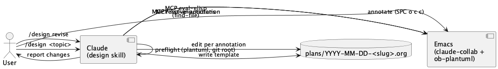

#+TITLE: /design skill
#+DATE: 2026-04-21
#+STARTUP: showall inlineimages

* Goal
  Replace =superpowers:writing-plans= with an Emacs-native planning skill.
  A single slash command =/design= authors a structured org-mode plan
  artifact with a PlantUML architecture diagram; a =revise= subcommand
  applies claude-collab annotations to the file in place. The aim is a
  frictionless annotate-then-hand-back loop for iterating on designs —
  not a replacement for built-in =/plan='s approval/execution flow.

* Approach
  Three modes in one user-level skill (=~/.claude/skills/design/=),
  dispatched by the first arg:
  - =/design <topic>= authors a plan (default)
  - =/design revise [file]= applies annotations
  - =/design status= lists open plans with annotation counts

  It integrates with infrastructure already in place in this repo:
  - =ob-plantuml= for inline diagram rendering (wired up in =user-config.el=,
    commit 6627d24)
  - =claude-collab= annotations for the revise loop (shipped in commit
    4143161)
  - Emacs MCP =eval-elisp= for opening files and poking Emacs state

  Plan artifacts live in =./plans/= when =cwd= is inside a git repo, else
  =~/plans/=. Same-day same-slug invocations /continue/ an existing file
  (open it) rather than clobbering.

  One prerequisite change lives in =lisp/claude-collab.el=: auto-enable
  annotation mode for =*.org= files under any =plans/= directory. Without
  this, =/design= hands the user a file where =SPC o c c= does nothing —
  a silent failure of the whole loop.

* Architecture
  #+begin_src plantuml :file design-skill-arch.png
  @startuml
  actor User
  component "Claude\n(design skill)" as Claude
  component "Emacs\n(claude-collab +\nob-plantuml)" as Emacs
  database "plans/YYYY-MM-DD-<slug>.org" as File

  User -> Claude : /design <topic>
  Claude -> Claude : preflight (plantuml, git root)
  Claude -> File : write template
  Claude -> Emacs : MCP eval-elisp\n(find-file)
  User -> Emacs : annotate (SPC o c c)
  User -> Claude : /design revise
  Claude -> Emacs : MCP list-annotations
  Claude -> File : edit per annotation
  Claude -> Emacs : MCP resolve-annotation
  Claude -> User : report changes
  @enduml
  #+end_src

  #+RESULTS:
  

* Steps
  1. [ ] Auto-enable claude-collab annotations for =plans/*.org=
     :PROPERTIES:
     :files: lisp/claude-collab.el
     :END:
     Add a hook so buffers visiting =.org= files under any =plans/=
     directory (project-local and =~/plans/=) enter
     =claude-collab-annotation-mode= on open. Verify =SPC o c c= works on a
     fresh file in =~/plans/foo.org=.

  2. [ ] Draft =design/SKILL.md= — author mode
     :PROPERTIES:
     :files: ~/.claude/skills/design/SKILL.md
     :END:
     Frontmatter: name =design=, pushy description covering =/design=,
     "design X", "plan X", "sketch a plan for X". Body: subcommand
     dispatch (=revise= vs. default author), preflight checks (plantuml
     binary, MCP availability), file-location logic (git-root detection),
     the template, MCP call to open the file. Collision handling: open
     existing file unchanged.

  3. [ ] Add revise subcommand logic to the same =SKILL.md=
     :PROPERTIES:
     :files: ~/.claude/skills/design/SKILL.md
     :END:
     File-to-operate-on detection: current Emacs buffer → most recent
     plan → explicit arg override. Then: list annotations → edit file
     per annotation → resolve each. Report a bullet list of changes in
     chat.

  4. [ ] Add status subcommand logic to the same =SKILL.md=
     :PROPERTIES:
     :files: ~/.claude/skills/design/SKILL.md
     :END:
     Scope: plans under the current git repo's =./plans/= if inside one,
     else =~/plans/=. For each =.org= file, call claude-collab MCP to
     count pending and resolved annotations, grab the file's mtime, and
     emit a bullet list sorted most-recent first:
     =plans/2026-04-21-design-skill.org — 3 open, 5 resolved (2h ago)=.
     Silent if no plans exist.

  5. [ ] Write 2–3 test prompts
     :PROPERTIES:
     :files: ~/.claude/skills/design/evals/evals.json
     :END:
     Realistic prompts covering: (a) new design with topic arg, (b) new
     design without topic arg (prompt-back path), (c) revise after
     annotating, (d) status when plans exist. Per skill-creator workflow.

  6. [ ] Iterate on SKILL.md via skill-creator review loop
     :PROPERTIES:
     :files: ~/.claude/skills/design/SKILL.md
     :END:
     Keep =SKILL.md= under 500 lines; factor long reference content into
     =references/= if it grows.

* Risks
  - =which plantuml= false-negative on an unusual shell env. Mitigation:
    the user's wrapper is in PATH per commit 6627d24; if preflight fails
    on a real setup, the abort message tells them the fix.
  - Annotation-mode hook in =claude-collab.el= could match too loosely
    and activate on unintended =.org= files. Mitigation: scope the
    matcher to =.org= files whose directory ends in =/plans/= or
    =/plans=.
  - MCP =eval-elisp= unavailable mid-session. Mitigation: skill writes
    the file and prints the path regardless; opening Emacs is
    best-effort.

* Open questions
  - [ ] Should =/design= auto-render the diagram after writing
    (=org-babel-execute-src-block=)? Current call: no, manual =C-c C-c=.
    Revisit if users forget to render.
  - [ ] Slug rule for topics containing non-filename-safe chars. Current
    rule: strip to =[a-z0-9-]=, collapse dashes. Fine for v1.
