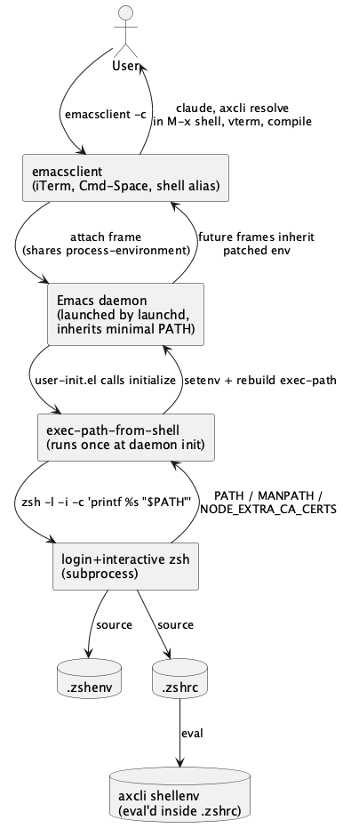

#+TITLE: Sync Emacs PATH with interactive shell
#+DATE: 2026-04-21
#+STARTUP: showall inlineimages

* Goal
  Make the ~claude~ CLI (and any other tool installed under
  ~~/.axcli/bin~ or ~~/.local/bin~) reliably resolvable from inside
  Emacs — in ~M-x shell~, ~compile~, ~project~ runners, and any
  package that consults ~exec-path~. Today it works in iTerm but not
  in GUI Emacs, because macOS GUI apps inherit PATH from ~launchd~
  rather than from ~.zshrc~, and ~axcli shellenv~ is sourced only in
  interactive shells.

  Fixing this now because axcli and brew are both shipping the
  ~claude~ binary through different paths, and the fragile "pin the
  absolute path" workaround in ~init.el:68~ only covers
  ~claude-code-ide~ — it doesn't help when the user types ~claude~ in
  an Emacs shell or when a new tool lands under ~~/.axcli/bin~.

* Approach
  Install ~exec-path-from-shell~ and call
  ~exec-path-from-shell-initialize~ once, early in the Emacs daemon's
  startup. This is the canonical fix on macOS.

  /How it works/: at call time the package spawns a login+interactive
  zsh (~zsh -l -i -c 'printf %s "$VAR"'~, one invocation per variable
  by default), waits for the subshell to source ~.zshenv~ *and*
  ~.zshrc~ — which is where ~axcli shellenv~ lives — captures the
  printed values, then mirrors them back into Emacs via ~setenv~ for
  ~process-environment~ plus a rebuild of ~exec-path~ from the new
  ~PATH~. Out of the box it covers ~PATH~ and ~MANPATH~; anything
  else is opt-in via ~exec-path-from-shell-variables~. The
  subprocess dance happens once per ~initialize~, not per
  ~executable-find~, so the runtime cost after startup is zero.

  /Why it fits our setup/: the Emacs daemon is launched by ~launchd~
  (at login or on first ~emacsclient~ call) and inherits the short,
  ~/etc/paths~-derived PATH that launchd hands it — which omits
  ~~/.axcli/bin~, ~~/.local/bin~, nvm, pyenv, and brew's
  ~/opt/homebrew/bin~ in some boot paths. Every frame
  ~emacsclient~ opens later shares the daemon's
  ~process-environment~. Running
  ~exec-path-from-shell-initialize~ once during daemon init patches
  the daemon's env in place, so all current and future frames see
  the corrected PATH without any per-frame work.

  One-time startup cost (~100–200ms on daemon launch) in exchange
  for never chasing PATH drift again.

  Rejected alternatives:
  - *Hand-maintained ~exec-path~ extension*: works, but every new
    tool dir (next month's ~~/.foo/bin~) means another edit. Same
    class of problem we're solving.
  - *Move axcli PATH line to ~.zshenv~*: globally effective but makes
    ~.zshenv~ load heavier for every zsh invocation (scripts, cron,
    hooks). ~.zshenv~ should stay minimal.
  - *Symlink ~claude~ into ~/opt/homebrew/bin~*: brew already owns a
    ~claude~ there as of today (Apr 21). Adding our own symlink
    fights brew; removing brew's loses the upstream update path.

  Once ~exec-path-from-shell~ is in, the hardcoded
  ~claude-code-ide-cli-path~ in ~init.el:68~ becomes redundant and
  can be dropped — cleanup, not a breaking change.

* Architecture
  #+begin_src plantuml :file emacs-shell-path-sync-arch.png
  @startuml
  skinparam componentStyle rectangle

  actor User
  component "emacsclient\n(iTerm, Cmd-Space, shell alias)" as Client
  component "Emacs daemon\n(launched by launchd,\ninherits minimal PATH)" as Daemon
  component "exec-path-from-shell\n(runs once at daemon init)" as EPFS
  component "login+interactive zsh\n(subprocess)" as LoginZsh
  database ".zshenv" as Zshenv
  database ".zshrc" as Zshrc
  database "axcli shellenv\n(eval'd inside .zshrc)" as AxcliEnv

  User --> Client : emacsclient -c
  Client --> Daemon : attach frame\n(shares process-environment)
  Daemon --> EPFS : user-init.el calls initialize
  EPFS --> LoginZsh : zsh -l -i -c 'printf %s "$PATH"'
  LoginZsh --> Zshenv : source
  LoginZsh --> Zshrc : source
  Zshrc --> AxcliEnv : eval
  LoginZsh --> EPFS : PATH / MANPATH /\nNODE_EXTRA_CA_CERTS
  EPFS --> Daemon : setenv + rebuild exec-path
  Daemon --> Client : future frames inherit\npatched env
  Client --> User : claude, axcli resolve\nin M-x shell, vterm, compile
  @enduml
  #+end_src

  #+RESULTS:
  

* Steps
  1. [ ] Add ~exec-path-from-shell~ to the package layer
     :PROPERTIES:
     :files: init.el
     :END:
     Add the package name to ~dotspacemacs-additional-packages~ in
     ~init.el~ so Spacemacs installs it on next ~SPC f e R~.

  2. [ ] Configure and initialize the package
     :PROPERTIES:
     :files: lisp/user-init.el
     :END:
     In ~user-init.el~, add a ~use-package~ block guarded on
     ~(memq window-system '(mac ns x))~ (skip for terminal Emacs —
     it already inherits the invoking shell's PATH). Call
     ~exec-path-from-shell-initialize~. Optionally declare extra
     vars we care about (e.g. ~NODE_EXTRA_CA_CERTS~ from axcli) via
     ~exec-path-from-shell-variables~.

  3. [ ] Drop the hardcoded claude-code-ide CLI path
     :PROPERTIES:
     :files: init.el
     :END:
     Remove the ~claude-code-ide-cli-path~ override at ~init.el:68~
     and its 3-line justification comment. Let the package's own
     PATH-based detection resolve ~claude~ naturally. Keep the
     ~--dangerously-skip-permissions~ flag and other settings.

  4. [ ] Verify the fix
     :PROPERTIES:
     :files: —
     :END:
     Restart Emacs (or ~M-x exec-path-from-shell-initialize~ in the
     running session). Confirm: ~M-: (executable-find "claude")~
     returns a non-nil path, ~M-x shell~ can run ~claude --version~,
     and ~M-x claude-code~ still launches the CLI. Do the same for
     ~axcli~ itself as a second sanity check.

  5. [ ] Commit
     :PROPERTIES:
     :files: init.el, lisp/user-init.el
     :END:
     One commit titled something like "Import shell PATH into Emacs
     via exec-path-from-shell". Body notes that this replaces the
     per-tool absolute-path workaround.

* Risks
  - *Startup latency*: ~exec-path-from-shell~ spawns a login shell
    at init, adding 100–300ms. Mitigation: acceptable one-time cost;
    if it bites, switch to ~exec-path-from-shell-arguments '("-l")~
    (login only, skip interactive) to drop ~.zshrc~ sourcing cost —
    but that would also drop ~axcli shellenv~, defeating the point.
    So accept the hit.
  - *~.zshrc~ side effects on init*: anything noisy in ~.zshrc~
    (prints to stdout, prompts for input) will slow or hang
    ~exec-path-from-shell~. Mitigation: if startup hangs, gate
    ~.zshrc~ side effects on ~[[ -o interactive ]]~ or on
    ~$PS1~.
  - *Terminal Emacs double-configures*: running the package under
    ~-nw~ would re-import an already-correct PATH. The
    ~window-system~ guard prevents this.

* Open questions
  - [ ] Should we also pull in ~NODE_EXTRA_CA_CERTS~ (set by
    ~axcli shellenv~) explicitly via
    ~exec-path-from-shell-variables~, or rely on it being in the
    login shell env already? Probably the former — explicit beats
    implicit, and it documents what Emacs cares about.
  - [ ] Is there any Spacemacs-specific hook ordering issue with
    calling ~exec-path-from-shell-initialize~ from ~user-init~
    rather than ~user-config~? ~user-init~ runs before layer
    packages load, which is what we want so that
    ~claude-code-ide~'s detection runs against the corrected PATH.
