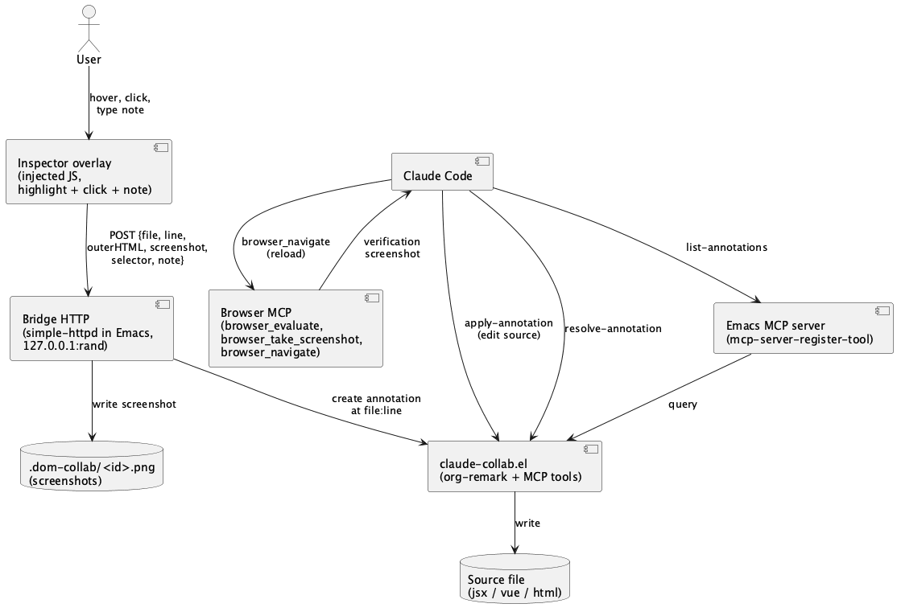

#+TITLE: DOM-level feedback w stylu Claude Desktop preview / Cursor
#+DATE: 2026-05-02
#+STARTUP: showall inlineimages
#+TODO: TODO CLARIFY(c) | DONE RESOLVED(r)

* Goal
  Bring "point at a DOM element, write a note, have Claude apply
  the change and verify" to the existing Emacs + Playwright +
  claude-collab stack. Mattrol. The remaining gap is the
  in-page inspector overlay plus a way to pin DOM annotations to
  source lines (not CSS selectors, which break on redesigns).

* Approach
Piggyback on three primitives already in the stack: a browser-control MCP (default recommendation: =chrome-devtools-mcp= attached to the user's running Chrome — see "Substrate choice" at the end of Approach for why we picked it over Playwright MCP)  for the embedded browser, claude-collab for annotation lifecycle
  + undo coupling, and a tiny local HTTP bridge for the in-page →
  Emacs round-trip. We do NOT build a parallel "dom-collab"
  annotation system; every DOM annotation resolves into a regular
  claude-collab annotation in a *source file*, with the captured DOM
  context (truncated outerHTML, screenshot path, computed-style
  subset, user note) packed into the annotation's =:label=. That
  way the entire MCP surface (=claude-collab-list-annotations=,
  =claude-collab-apply-annotation=, =claude-collab-resolve-annotation=)
  works unchanged and we keep the same undo coupling.

  Source-line resolution is the durability axis. In order of
  preference: (1) React Fiber =_debugSource= walk when the page is a
  React dev build (~30 lines of injected JS, identical to React
  Grab's approach); (2) build-time JSX-stamp plugin when the user
  controls the build (Lovable-style — out of scope for v1, see Open
  questions); (3) CSS selector + screenshot fallback when neither
  works — annotation lands in a project-local =dom-feedback.org=
  sink and Claude is asked to resolve which source file to edit.
  This anchors annotations to source — the same durability property
  buffer annotations have today — and avoids the selector-drift
  problem that bites Cursor's design mode.

  Verification round-trip: after Claude edits and saves, the browser MCP
  reloads the page and takes a verification screenshot; the
  annotation is auto-resolved if the visual diff against the
  captured crop is acceptable, exactly mirroring the existing buffer
  flow. =[CLARIFY: ship build-time JSX-stamp (Lovable-style) as v2,
  or skip entirely if the Fiber path proves robust enough on the
  user's actual frontend?]=

  Substrate choice (=chrome-devtools-mcp= over Playwright MCP). The
  user's hunch about Playwright MCP being slow is partially right —
  the dominant cost isn't the wire protocol (CDP under both is fast)
  but (a) cold-launching a fresh Chromium per session, (b) Playwright's
  per-action auto-wait/locator resolution, and (c) tool-surface
  proliferation that makes the model dither. =chrome-devtools-mcp=
  fixes (a) by attaching to a long-lived Chrome via
  =--browser-url=http://127.0.0.1:9222= (so your real session, with
  React DevTools and auth cookies intact, is reused), exposes thinner
  CDP-shaped primitives (=navigate_page=, =evaluate_script=,
  =take_screenshot=), and trims the surface area. Estimated round-trip
  for navigate + evaluate + screenshot: ~150–400 ms warm vs ~600 ms–2 s
  with Playwright. Other paths considered and parked: pure CDP over
  =websocket.el= (lowest latency, ~300 LOC of plumbing — only worth
  it if MCP overhead still bites); a Vite-middleware injection that
  serves the overlay and POSTs back (simplest v0, but loses true
  screenshots — falls back to =html2canvas=); =xwidget-webkit=
  in-Emacs (in-process, but no first-class screenshot API — brittle
  for image round-trips); a browser extension (in-process latency,
  zero install ceremony after one =Load unpacked=, persistent real
  session — user explicitly favoured this; serious v1 candidate, see
  Open questions for the v1-substrate decision). The Bridge HTTP
  endpoint and the Steps below are substrate-agnostic; switching
  later is one =browser_evaluate=-equivalent call site.

* Architecture
  #+begin_src plantuml :file dom-feedback-w-stylu-claude-desktop-preview-arch.png
  @startuml
  actor User
  component "Browser MCP\n(browser_evaluate,\nbrowser_take_screenshot,\nbrowser_navigate)" as PW
  component "Inspector overlay\n(injected JS,\nhighlight + click + note)" as Overlay
  component "Bridge HTTP\n(simple-httpd in Emacs,\n127.0.0.1:rand)" as Bridge
  component "claude-collab.el\n(org-remark + MCP tools)" as CC
  component "Emacs MCP server\n(mcp-server-register-tool)" as MCP
  component "Claude Code" as Claude
  database "Source file\n(jsx / vue / html)" as Src
  database ".dom-collab/<id>.png\n(screenshots)" as Disk

  User --> Overlay : hover, click,\ntype note
  Overlay --> Bridge : POST {file, line,\nouterHTML, screenshot,\nselector, note}
  Bridge --> Disk : write screenshot
  Bridge --> CC : create annotation\nat file:line
  Claude --> MCP : list-annotations
  MCP --> CC : query
  Claude --> CC : apply-annotation\n(edit source)
  CC --> Src : write
  Claude --> PW : browser_navigate\n(reload)
  PW --> Claude : verification\nscreenshot
  Claude --> CC : resolve-annotation
  @enduml
  #+end_src

  #+RESULTS:
  

* Steps
  1. [ ] Spike: prove React Fiber =_debugSource= resolution against a real dev page
     :PROPERTIES:
     :files:  experiments/dom-feedback/fiber-spike.html, experiments/dom-feedback/fiber-spike.js
     :tests:  experiments/dom-feedback/fiber-spike-test.el
     :verify: ERT test (driving the browser MCP) clicks a known JSX element and asserts the returned file:line:col matches the dev sourcemap
     :END:
     Smallest possible JS that walks =__reactFiber$*= upward and
     prints =_debugSource=. We need this to fail-fast on stacks
     without dev sourcemaps so we know whether to default to the
     CSS-selector fallback for v1. =[CLARIFY: target project for the experiment — your existing
     React app, or a throwaway =vite create-react-app= we set up just
     to prove the idea? See Open questions for the plain-English
     framing.]=

  2. [ ] Inspector overlay JS — highlight, click, note prompt, payload assembly
     :PROPERTIES:
     :files:  lisp/dom-collab/overlay.js
     :tests:  lisp/dom-collab/overlay-test.el
     :verify: Browser-MCP-driven ERT test injects the overlay, simulates a click + note, asserts the captured payload contains {outerHTML, screenshotPath, computedStylesSubset, fiberSource?, cssPath, note}
     :END:
     ~150 LOC. Hover paints an absolute-positioned highlight (React
     DevTools-style); click freezes selection; floating textarea
     collects the note; Esc cancels; submit POSTs to the Bridge.
     Served as a static asset and injected via
     =the browser MCP's =evaluate= primitive= — no
     build step on the user's project.

  3. [ ] Bridge HTTP endpoint inside Emacs (=simple-httpd= or =web-server=)
     :PROPERTIES:
     :files:  lisp/dom-collab/dom-collab.el
     :tests:  lisp/dom-collab/dom-collab-test.el
     :verify: ERT test POSTs a synthetic payload, asserts a claude-collab annotation appears in the target source file at the reported file:line and the screenshot is on disk
     :END:
     Receives the overlay's POST; resolves source =file:line= (Fiber
     path or selector fallback); writes screenshot to
     =.dom-collab/<id>.png=; calls into existing
     =claude-collab--mcp-*= plumbing to create the annotation in the
     source file with the DOM payload packed into =:label=. No new
     MCP tools registered — Claude reads via the same
     =claude-collab-list-annotations= it already uses.
     Default package shape: sibling =dom-collab.el= depending on
     claude-collab (cleaner separation; claude-collab stays focused
     on buffers). See Open questions for the broader bridge-location
     question.

  4. [ ] CSS-selector fallback path
     :PROPERTIES:
     :files:  lisp/dom-collab/dom-collab.el
     :tests:  lisp/dom-collab/dom-collab-test.el
     :verify: When Fiber data is absent, payload routes to a project-local =dom-feedback.org= as a TODO checkbox with selector + screenshot + note, and *Messages* prints which tier was used
     :END:
     For non-React pages and prod-stripped builds. Annotation lands
     in =dom-feedback.org= as a checklist item; Claude reads it,
     decides which source file to edit, and the entry is then
     re-anchored or resolved manually. Surface the tier in the UI
     so users understand why an annotation didn't auto-pin to source.

  5. [ ] Verification screenshot loop
     :PROPERTIES:
     :files:  lisp/dom-collab/dom-collab.el
     :tests:  lisp/dom-collab/dom-collab-test.el
     :verify: After =claude-collab-resolve-annotation= fires on a DOM-originated annotation, the browser MCP reloads the active tab and stores before/after screenshots under =.dom-collab/<id>/=
     :END:
     Advise =claude-collab--resolve-annotation=: when the annotation
     carries a DOM payload, trigger a the browser MCP's =navigate=
     + =browser_take_screenshot= and store the pair. No automatic
     accept/reject — the human eyeballs the diff (matches existing
     claude-collab philosophy of human-in-the-loop resolution).

  6. [ ] UX entry point: =SPC o c d= — "start DOM annotation session"
     :PROPERTIES:
     :files:  lisp/user-config.el, lisp/dom-collab/dom-collab.el
     :tests:  lisp/dom-collab/dom-collab-test.el
     :verify: =M-x describe-key SPC o c d= shows =dom-collab-start=; running it prompts for URL (default from =.dir-locals.el= dev-server var if set), opens the browser via the MCP, injects overlay, starts Bridge HTTP if not running
     :END:
     One command, mirrored after =SPC o c c= muscle memory:
     =SPC o c c= = annotate buffer text, =SPC o c d= = annotate DOM.
     Reads project-local default URL from =.dir-locals.el= so each
     project can preset its dev server.

  7. [ ] Bidirectional pin — Emacs ↔ live page
     :PROPERTIES:
     :files:  lisp/dom-collab/dom-collab.el, lisp/user-config.el
     :tests:  lisp/dom-collab/dom-collab-test.el
     :verify: =M-x dom-collab-jump-to-element= on a DOM-originated annotation scrolls the live browser to that element and re-paints the highlight; asserted via =browser_evaluate= that =scrollIntoView= ran and the highlight class is present.
     :END:
     Reverse of Step 2's direction (Emacs → browser instead of
     browser → Emacs). When the user opens a DOM-originated
     annotation in Emacs, =SPC o c j= (=dom-collab-jump-to-element=)
     POSTs the stored selector / Fiber path back to the overlay over
     the same Bridge HTTP; the overlay re-locates the element, runs
     =scrollIntoView({block: "center"})=, and re-applies the
     inspector highlight class. Same Bridge, no new transports —
     ~30 LOC of overlay JS for the back-channel handler.

  8. [ ] Docs in =lisp/dom-collab/README.org= + an evals entry
     :PROPERTIES:
     :files:  lisp/dom-collab/README.org, skills/design/evals/evals.json
     :tests:  none (docs)
     :verify: README explains the three durability tiers (Fiber → build-stamp future → selector fallback), shows a worked example, and documents the iframe / cross-origin limitation
     :END:
     Bias toward terse — the failure modes (no source mapping,
     iframe boundaries, selector drift) need clear docs or users
     will hit them and not know why annotations land in the
     fallback file.

* Risks
  - Source mapping breaks on non-React or prod-stripped builds — mitigated by the explicit selector fallback (Step 4) and a *Messages* line that names the tier.
  - Cross-origin iframes block =browser_evaluate= — out of scope for v1; document the limitation in the README.
  - Screenshot payloads bloat annotation labels — store on disk under =.dom-collab/<id>.png= and reference by path, never embed.
  - Bridge HTTP port conflict — bind on =127.0.0.1= with a random free port, write it to =~/.cache/dom-collab.port=, overlay reads it from a =<meta>= tag the inspector script writes at startup.
  - CSS-selector drift between annotation creation and resolution — accepted as inherent to the fallback tier; that's why Fiber path is preferred.

* Open questions
  - [ ] [[*Step 1: Spike — prove React Fiber =_debugSource= resolution against a real dev page][Step 1]]: Plain-English version: when you click an element on a React dev page, can we trace it back to *the exact JSX file and line number* in your source code? React keeps that mapping internally (in something called the "Fiber tree") for its own DevTools — we just need a tiny experiment to confirm we can read it from a regular page. The question: is there a React project of yours we should test this on, or should we spin up a fresh =vite create-react-app= just to validate the idea? (If you don't have a React project, vanilla scaffold is fine — we just need to know which path to set up.)
  - [ ] [[*Step 3: Bridge HTTP endpoint inside Emacs (=simple-httpd= or =web-server=)][Step 3]]: bridge location — embed in Emacs (default; ties feature to this setup, mirrors how claude-collab works today), or run as a small standalone daemon so any IDE (VS Code, Cursor) could plug into it? Why a bridge exists at all: in-page JS can't speak MCP directly (MCP is stdio between Claude and its tools), so the overlay needs *some* local HTTP target to POST the payload to.
  - [ ] [[*Approach][Approach]]: build-time JSX-stamp plugin (Lovable-style) for v2, or skip if Fiber proves robust enough?
  - [ ] [[*Approach][Approach §Substrate choice]]: v1 substrate — start with =chrome-devtools-mcp= (no install, fastest path to running spike + overlay) and roadmap the browser extension as v1.5; OR commit to the extension as v1 from day one (best ergonomics, ~1–2 days extra build for manifest + content script + localhost POST, but Steps 1–3 land identically since the overlay JS is substrate-agnostic). User signalled enthusiasm for the extension — need a call on shipping order.
  - [X] [[*Step 7: Bidirectional pin — Emacs ↔ live page][Step 7]]: Confirmed in scope (user approved); promoted from "nice-to-have" to its own Step.

* Research
  Survey of existing browser extensions and runtime libraries that could
  replace building our own from scratch. Question driving the research:
  *can we install something instead of building?*

  Top finding: =react-grab= covers ~80% of requirements out-of-the-box —
  React Fiber walk with source-map resolution to =file:line:col=,
  alt-click element picker UI, free-text note via =commentPlugin=, and a
  built-in =createMcpPlugin({port})= that POSTs to a local HTTP endpoint
  (exactly the shape our Bridge expects). Patch to add full =outerHTML=
  + screenshot: ~40 LOC across 2–3 files, no fork required. Steps 1–2
  collapse dramatically if we adopt it as foundation.

** Comparison

   | Project             | License    | Last commit | Stars | File:line  | UI picker         | Note input        | Local POST           | Screenshot         | Adapt effort                 | Verdict                  |
   |---------------------+------------+-------------+-------+------------+-------------------+-------------------+----------------------+--------------------+------------------------------+--------------------------|
   | =react-grab=        | MIT        | 2026-05-01  |  7.1k | ✅ Fiber    | ✅ alt-click       | ✅ commentPlugin   | ✅ MCP plugin         | ❌ build (~20 LOC)  | ~40 LOC, no fork             | *Recommended foundation* |
   | =locatorjs=         | MIT        | 2026-03-01  |  1.8k | ✅ Fiber    | ✅ alt-click       | ❌                 | ⚠ via URL template   | ❌                  | ~80–100 LOC, light fork      | Backup if react-grab breaks |
   | =bippy=             | MIT        | 2026-04-14  |   —   | ✅ library  | ❌                 | ❌                 | ❌                    | ❌                  | Lowest-level building block  | Used indirectly via react-grab |
   | =stagewise=         | AGPL-3.0   | 2026-05-01  |  6.7k | ⚠ in-app   | ✅ standalone browser | ✅              | via Karton WebSocket | ✅                  | Heavy — Electron app + RPC   | Skip (license + arch)    |
   | =browser-tools-mcp= | MIT        | 2025-03     |  7.2k | ❌          | ❌ AI-driven       | ❌                 | ✅ WebSocket          | ✅                  | Wrong UX direction           | Not a fit                |
   | =VisBug=            | MIT        | maintained  | many  | ❌          | ✅ visual edit     | ❌                 | ❌ no payload         | ❌                  | Edit-only, no emit           | Not a fit                |
   | DOM AI Bridge (CWS) | proprietary | 2026       |   —   | ❌          | ✅                 | ⚠ paste            | ❌ clipboard          | ❌                  | Opaque, no source            | Skip                     |
   | =Marker.io=         | SaaS       | active      |   —   | ❌          | ✅                 | ✅                 | ✅ webhook            | ✅                  | Paywalled, no Fiber          | Skip                     |

** Pros / cons of the top candidates

*** =react-grab= (recommended foundation)
    - + MIT, 7k★, daily commits — a living project
    - + =createMcpPlugin({port})= already does exactly POST → local HTTP, matches our Bridge shape
    - + Free-text note via =commentPlugin= + Fiber source mapping that resolves through Next.js / Vite source maps automatically
    - + =bippy= underneath — lowest-level Fiber introspection without depending on the React DevTools hook
    - − =outerHTML= is a truncated preview, not the full element (1-line fix in =packages/react-grab/src/core/context.ts:~290=)
    - − No native screenshot (~20 LOC plugin using =html2canvas= or =chrome.tabs.captureVisibleTab=)
    - − No native bidirectional pin (Step 7) — own plugin, ~30 LOC
    - − Strongest on React; non-React frameworks fall back to selector + outerHTML

*** =locatorjs= (backup)
    - + MIT (per-package), still active
    - + Configurable URL template — could point at =emacs://= or HTTP query string
    - − Only file:line via deep-link; no outerHTML / screenshot / note UI out of the box
    - − ~80–100 LOC fork to add full payload

*** =stagewise= (skip)
    - − AGPL-3.0 — derivative work served over network must be open-sourced; bad fit for personal Emacs config
    - − Standalone Electron browser, not an extension — completely different architecture
    - − IDE bridge via custom Karton WebSocket RPC; reimplementing that on top of =simple-httpd= would be days

** Implications for the plan

   If we adopt =react-grab= as foundation:
   - Step 1 (Fiber spike) becomes "install =react-grab= in Your dev project, confirm =file:line:col= resolves correctly" — minutes, not a spike.
   - Step 2 (overlay JS) shrinks from ~150 LOC custom build to ~30 LOC =react-grab= plugin config + a custom =onCopySuccess= hook.
   - Step 3 (Bridge HTTP in Emacs) is unchanged — still the receiving end.
   - Step 4 (CSS-selector fallback) is partially handled by =react-grab='s non-React path; we still need the =dom-feedback.org= sink for prod-stripped builds.
   - Step 7 (bidirectional pin) is unchanged — =react-grab= doesn't do this; ~30 LOC custom plugin posting back.

   Open question: see Open questions §"v1 substrate". If we adopt =react-grab=, the Substrate-choice CLARIFY narrows to "do we use =react-grab='s built-in extension build, or its =npm install= runtime mode?" — both work; extension means zero per-project install, runtime mode means per-project devDependency.

** Links

   - React Grab — https://github.com/aidenybai/react-grab
   - React Grab "for agents" post — https://www.react-grab.com/blog/agent
   - bippy (Fiber introspection lib) — https://github.com/aidenybai/bippy
   - LocatorJS — https://github.com/infi-pc/locatorjs
   - LocatorJS docs — https://www.locatorjs.com/
   - stagewise — https://github.com/stagewise-io/stagewise
   - Lovable Visual Edits (build-time JSX-stamp approach) — https://lovable.dev/blog/visual-edits
   - chrome-devtools-mcp issue #268 (select-an-element-to-inspect proposal) — https://github.com/ChromeDevTools/chrome-devtools-mcp/issues/268
   - browser-tools-mcp (AI-driven, not human picker) — https://github.com/AgentDeskAI/browser-tools-mcp
   - VisBug (edit-only) — https://github.com/GoogleChromeLabs/ProjectVisBug
   - Marker.io webhooks — https://help.marker.io/en/articles/3738778-webhooks-integration
   - Cursor browser visual editor — https://cursor.com/blog/browser-visual-editor
   - Claude Code Desktop "Preview your app" — https://code.claude.com/docs/en/desktop
